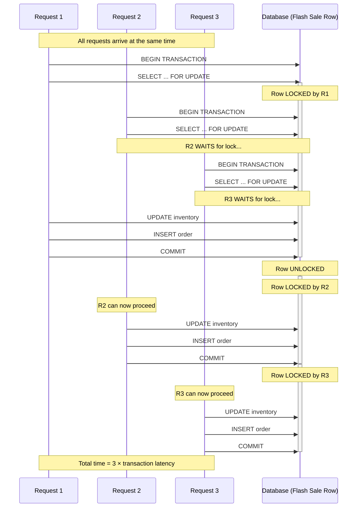

# Devlog 01: Naive FlashDeal

> **Phase 1** | [Detailed Checklist](../phases/01_naive_flash_deal.md)

**Objectives**: Implement a correct but slow order flow using pessimistic locking. Centralize inventory as a single lock.

**Design Choices**: Single inventory row per flash sale, pessimistic locking via `SELECT FOR UPDATE`, synchronous transactional HTTP flow.

---

## Building the Real Thing

Phase 1 was exciting—finally implementing actual business logic instead of just infrastructure. The goal was simple: let users create orders for flash sales, and make sure we never oversell. The "naive" part? I'm using pessimistic locking with a single inventory row. I know it won't scale, but correctness comes first.

## The Core Flow

Here's what happens when someone tries to buy something:

1. Start a database transaction
2. Lock the flash sale row with `SELECT ... FOR UPDATE`
3. Check if there's inventory left
4. If yes, decrement the count and create an order
5. If no, return a "sold out" error
6. Commit the transaction

The `FOR UPDATE` lock is the key. It ensures that only one transaction can modify a specific flash sale at a time. No race conditions, no overselling. The trade-off? Throughput is limited by transaction latency. If each transaction takes 50ms, I can only handle about 20 requests per second for that sale.

I knew this wouldn't scale to thousands of concurrent users, but that's the point. I wanted a correct baseline to measure against when I optimize later.

### Visualizing Lock Contention

Here's what happens when multiple requests arrive concurrently:



**Key Insight**: With pessimistic locking, requests are processed **serially**, not in parallel. If each transaction takes 50ms, three concurrent requests take 150ms total. This is why writes are slow—they're waiting in line for the lock.

## Cleaning Up the Terminology

Early on, I had a mismatch between my HTTP layer and domain logic. The endpoint was `/api/purchases`, but my domain object was called `Order`. The logic layer had functions like `create_purchase`, but they returned `Order` objects. It was confusing.

I decided to standardize on "Order" everywhere:
- Renamed the endpoint to `/api/orders`
- Changed `purchase_handler` to `order_handler`
- Updated DTOs and service functions to use "order" terminology

It seems minor, but consistency matters. When you're debugging at 2 AM, you don't want to waste mental energy translating between "purchase" and "order."

## The Repository Record Pattern

As I built out the repositories, I realized I needed to decouple my domain objects from the database schema. Domain models should represent business concepts, not database rows. But SQLx needs structs that implement `FromRow` to deserialize query results.

The solution? A "Record" pattern:

1. Each repository defines a `*Record` struct (e.g., `OrderRecord`, `FlashSaleRecord`) that mirrors the database schema
2. These records implement `sqlx::FromRow`
3. Repositories query into records, then convert them to domain objects via `From`/`Into` traits

This gives me flexibility. If I need to add a computed field to a domain object or rename a property, I don't have to touch the database layer. The conversion happens at the boundary.

Here's what it looks like in practice:

```rust
// Database record - matches the schema
struct OrderRecord {
    id: Uuid,
    user_id: Uuid,
    flash_sale_id: Uuid,
    created_at: DateTime<Utc>,
}

// Domain object - represents business logic
struct Order {
    id: OrderId,
    user: UserId,
    sale: FlashSaleId,
    timestamp: DateTime<Utc>,
}

// Conversion at the boundary
impl From<OrderRecord> for Order {
    fn from(record: OrderRecord) -> Self {
        // Map database types to domain types
    }
}
```

It's a bit more boilerplate, but it keeps concerns separated. The domain doesn't care about SQLx, and the database layer doesn't care about business rules.

## The Transaction Management Puzzle

This was one of those problems that seemed simple at first but turned into a rabbit hole.

### The Problem

When I started implementing `create_order`, I hit an API inconsistency issue. The function needed to:
1. Fetch the flash sale (using `FlashSaleRepo`)
2. Check inventory and update it
3. Create the order (using `OrderRepo`)

All of this had to happen in a single transaction—if any step fails, everything rolls back. But my original pattern of storing a `PgPool` in each repository didn't work here. I couldn't just call `repo.save()` because each call would get its own connection from the pool, breaking atomicity.

I needed a transaction to live from the handler all the way through the logic layer and into multiple repositories. But here's the catch: if I made `create_order` accept a `&mut Transaction`, it would be inconsistent with other logic functions that just needed a pool.

### First Attempt: Custom Executor Trait

My first instinct was to abstract it. I created a `DbExecutor` trait and a `PgExecutor` wrapper that could hold either a pool or a transaction:

```rust
trait DbExecutor {
    // Abstract over Pool and Transaction
}

struct PgExecutor {
    // Somehow hold either Pool or Transaction
}
```

The idea was that repositories would accept `&mut dyn DbExecutor`, and I could pass either a pool or a transaction depending on the context. Clean, right?

Wrong. I immediately ran into lifetime issues. `PgPool` is long-lived (it lives for the entire application), but `Transaction` is ephemeral (it only exists for the duration of a request). Rust's type system wasn't having it—I couldn't create a trait that could hold both without getting tangled in lifetime annotations.

### Second Attempt: Enum Wrapper

Okay, traits didn't work. What about an enum?

```rust
enum DbExecutor<'a> {
    Pool(&'a PgPool),
    Transaction(&'a mut Transaction<'a, Postgres>),
}
```

This felt promising, but then I'd have to `match` on the enum in every repository method to extract the actual executor. Plus, the lifetime problem *still* persisted—I'd need to thread lifetimes through every function signature, making the API ugly and complex.

I was stuck. There had to be a better way.

### The Breakthrough

Out of frustration, I decided to read SQLx's source code. I opened up `transaction.rs` to see how they handled this internally.

That's when I saw it: `Transaction` implements `DerefMut<Target = PgConnection>`. 

Everything clicked.

SQLx already solved this problem. Both `PgPool` and `Transaction` can give you a `&mut PgConnection`:
- `PgPool::acquire().await` returns a `PoolConnection`, which derefs to `&mut PgConnection`
- `Transaction` derefs directly to `&mut PgConnection`

I didn't need a custom trait or enum. I just needed to accept `&mut PgConnection` in my repository methods. The caller (handler or logic layer) would handle getting the connection—either from a pool or from a transaction.

### The Solution

Repository methods now look like this:

```rust
async fn save(&self, order: &Order, conn: &mut PgConnection) -> Result<Order> {
    // Use conn directly
}
```

In handlers that need transactions:

```rust
let mut tx = pool.begin().await?;
let order = create_order(&mut *tx, ...).await?;
tx.commit().await?;
```

In handlers that don't:

```rust
let mut conn = pool.acquire().await?;
let user = get_user(&mut *conn, ...).await?;
```

The API is consistent. Every logic function accepts `&mut PgConnection`. The handler decides whether to use a transaction or a single connection. The logic layer doesn't care—it just uses the executor it's given.

It's simple, idiomatic, and leverages SQLx's existing abstractions. Sometimes the best solution is the one that's already there.

## Reflecting on Trade-offs

Pessimistic locking is simple and correct, but it's a bottleneck by design. Every request for the same flash sale has to wait in line. Under light load, it's fine. Under heavy load, it'll crawl.

I could've gone with optimistic locking (check inventory, then update with a `WHERE` clause and retry on conflict), but I wanted to start simple. Optimistic locking is faster under low contention but requires retry logic and can waste work if conflicts are frequent.

For now, pessimistic locking gives me a correct baseline. Once I have metrics in place (Phase 2), I'll be able to measure the actual bottleneck and decide if optimistic locking is worth the complexity.

### Pessimistic vs Optimistic Locking

Here's a visual comparison of the two approaches:

```mermaid
flowchart TD
    Start[Request Arrives]
    
    subgraph Pessimistic["Pessimistic Locking (Current)"]
        P1[BEGIN TRANSACTION]
        P2[SELECT ... FOR UPDATE<br/>⏳ WAIT for lock if held]
        P3{Inventory > 0?}
        P4[UPDATE inventory<br/>INSERT order]
        P5[COMMIT]
        P6[Return Success]
        P7[ROLLBACK]
        P8[Return Sold Out]
        
        P1 --> P2
        P2 --> P3
        P3 -->|Yes| P4
        P3 -->|No| P7
        P4 --> P5
        P5 --> P6
        P7 --> P8
    end
    
    subgraph Optimistic["Optimistic Locking (Future)"]
        O1[BEGIN TRANSACTION]
        O2[SELECT inventory<br/>✅ No lock, no wait]
        O3{Inventory > 0?}
        O4[UPDATE inventory<br/>WHERE id = X AND inventory = old_value]
        O5{Rows affected?}
        O6[INSERT order]
        O7[COMMIT]
        O8[Return Success]
        O9[ROLLBACK]
        O10[Retry or Return Conflict]
        O11[ROLLBACK]
        O12[Return Sold Out]
        
        O1 --> O2
        O2 --> O3
        O3 -->|Yes| O4
        O3 -->|No| O11
        O4 --> O5
        O5 -->|1 row| O6
        O5 -->|0 rows<br/>Someone else updated| O9
        O6 --> O7
        O7 --> O8
        O9 --> O10
        O11 --> O12
    end
    
    Start --> Pessimistic
    Start --> Optimistic
    
    style P2 fill:#ffcccc
    style O2 fill:#ccffcc
    style O9 fill:#ffffcc
```



**Trade-offs**:

| Aspect                        | Pessimistic (Current) | Optimistic (Future)         |
| ----------------------------- | --------------------- | --------------------------- |
| **Correctness**               | ✅ Guaranteed          | ✅ Guaranteed (with retries) |
| **Concurrency**               | ❌ Serial execution    | ✅ Parallel reads            |
| **Latency (low contention)**  | ⚠️ Moderate            | ✅ Low                       |
| **Latency (high contention)** | ❌ Very high (queuing) | ⚠️ Moderate (retries)        |
| **Complexity**                | ✅ Simple              | ⚠️ Requires retry logic      |
| **Wasted work**               | ✅ None                | ⚠️ Retries waste CPU         |

For Phase 1, pessimistic locking is the right choice—it's simple and correct. But the diagram shows why it won't scale: that red "WAIT for lock" step serializes all requests.

## What's Next

The system works. Orders are created, inventory is tracked, and nothing oversells. But I'm flying blind—I have no idea what the actual performance characteristics are.

Phase 2 is all about observability. I need structured logging, metrics, and load testing before I can make informed optimization decisions. You can't improve what you can't measure.
