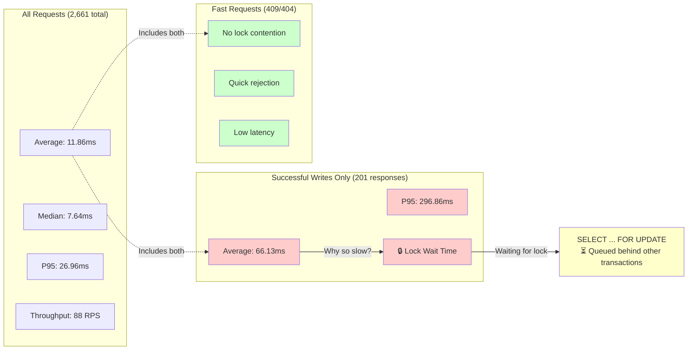

# Devlog 02: Observability First

> **Phase 2** | [Detailed Checklist](../phases/02_observability_first.md)

**Objectives**: Measure failures before fixing them.

**Additions**: Structured logging, latency metrics, database lock inspection.

---

## Measure Before You Optimize

I had a working system, but I was making assumptions about where the bottlenecks were. "Pessimistic locking will be slow under high concurrency" sounds right in theory, but how slow? At what point does it break down? Without data, I'd just be guessing.

Phase 2 was about building the instrumentation I needed to answer those questions. No optimizations yet—just visibility.

## Structured Logging with Tracing

I replaced my basic logging with the `tracing` ecosystem (`tracing` + `tracing-subscriber`). The big win? JSON-formatted logs that are easy to parse and query.

But the real game-changer was **request ID correlation**. I added middleware using `tower_http::request_id::PropagateRequestIdLayer` that generates a unique ID for every incoming request and includes it in all log entries. Now when something goes wrong, I can grep for that request ID and see the entire lifecycle—from the HTTP handler, through the logic layer, down to the database queries.

It's one of those things that seems like overkill until you're debugging a production issue at 3 AM and you can trace a single request through thousands of log lines in seconds. Then it's indispensable.

## Prometheus Metrics

Logs are great for debugging specific requests, but they don't give you the big picture. For that, I needed metrics.

I integrated Prometheus to track:
- **HTTP request durations** (histogram): How long are requests taking? What's the P95? P99?
- **SQLx connection pool stats**: How many connections are active? How many are idle? Are requests waiting for connections?

I created a middleware that wraps every HTTP request and records its duration in a histogram (`http_requests_duration_seconds`). Prometheus scrapes the `/metrics` endpoint every 15 seconds, and I can query it to see trends over time.

The connection pool metrics were especially useful. If I saw requests waiting for connections, I'd know the pool was too small. If I saw lots of idle connections, I'd know I was over-provisioned.

## The Load Testing Journey

Setting up k6 for load testing was more educational than I expected.

### First Attempt: The Foreign Key Fiasco

My initial test script generated random UUIDs for `user_id` and expected the server to create orders. It ran, but every single request failed with a foreign key violation. Of course—I was referencing users that didn't exist.

I updated the script to fetch real users from the `/users` endpoint in the `setup()` phase, then randomly pick from that list during the test. Problem solved.

### Second Challenge: Docker Networking

I containerized k6 to make it reproducible, but then it couldn't reach `localhost:3000` because it was running in a separate Docker network. I tried `localhost`, `127.0.0.1`, even the container name—nothing worked.

The fix? `host.docker.internal`. This special DNS name lets containers access services running on the host machine. Once I switched to that, k6 could hit the server.

It's one of those things that's obvious in hindsight, but when you're staring at "connection refused" errors, it's frustrating. I made a note to document this for future me.

### Baseline Results

With the setup fixed, I ran a 30-second load test with 10 concurrent users. Here's what I found:

**Performance:**
- **Throughput**: ~88 RPS (requests per second)
- **Total requests**: 2,661
- **Latency**:
  - Average: 11.86ms
  - Median: 7.64ms
  - P90: 16.94ms
  - P95: 26.96ms
  - Max: 344ms

**Success rate:**
- 98.12% of checks passed
- The "failures" were mostly 409 (sold out) and 404 (not found) responses, which are expected

**Key insight:** Successful writes (201 responses) had much higher latency—average of 66ms, P95 of 297ms. That's the pessimistic lock in action. Most requests were fast reads or conflicts, but the actual writes were slow because they had to wait for the lock.

The throughput (~88 RPS) was limited by the 100ms sleep in my test script (10 users / 0.11s ≈ 90 RPS). Under this light load, the system performed well. But I could already see the lock contention showing up in the P95 latency for writes.

This confirmed what I suspected: pessimistic locking works correctly but will struggle under higher concurrency. Now I had data to back it up.

### Visualizing the Lock Contention Impact

The load test results reveal the cost of pessimistic locking. Here's a visual breakdown:

**Key Takeaway**: The average latency (11.86ms) looks good because most requests are fast rejections (409/404). But successful writes tell the real story: **P95 of 297ms** shows the true cost of lock contention. When you need to actually write, you're waiting in line.

## The Observability Stack

I integrated Prometheus and Grafana into Docker Compose using profiles (the same pattern I set up in Phase 0):

- **Prometheus**: Scrapes `/metrics` every 15 seconds, stores time-series data
- **Grafana**: Pre-configured with Prometheus as a data source and anonymous admin access for quick iteration

Now I can visualize request latencies, throughput, and connection pool usage in real time. I can see spikes, trends, and correlations that would be invisible in logs alone.

The workflow is smooth: make a change, run a load test, check Grafana to see the impact. It's the feedback loop I needed.

## What I Learned

**Structured logs are a superpower.** Being able to trace a single request through the entire system with a request ID saves hours of debugging. JSON formatting makes it easy to pipe logs into analysis tools.

**Metrics give you the big picture.** Logs tell you what happened to specific requests. Metrics tell you what's happening to the system as a whole. You need both.

**Load testing is essential.** Without it, I'd be optimizing based on intuition and guesses. Now I have concrete numbers: P95 latency for writes is ~297ms under light load. That's my baseline. Any optimization needs to beat that.

**Docker Compose profiles scale well.** Being able to start just the database, or the database + observability stack, or everything keeps my development environment fast and flexible.

## Phase 2 Complete

The exit criteria for Phase 2 was simple: **all bottlenecks are measurable**. ✅ Done.

I can now see:
- Request latencies (P95, P99) via Prometheus metrics
- Lock contention impact (successful writes take 66ms avg, P95 of 297ms)
- Connection pool usage via exposed SQLx metrics
- Request correlation via structured logs with request IDs

More importantly, I have a baseline: ~88 RPS throughput, P95 latency of ~27ms for all requests, but P95 of ~297ms for successful writes. That's the cost of pessimistic locking under light load.

## What's Next

I have visibility. I have a baseline. Now I can start optimizing.

Phase 3 is about tackling the bottlenecks I've identified: admission control to prevent overload, and exploring optimistic concurrency to improve throughput under high contention. But this time, I'll be measuring every change to see if it actually helps.

No more guessing. Just data.
