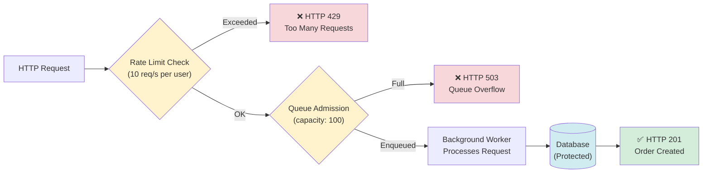

# Devlog 03: Admission Control

> **Phase 3** | [Detailed Checklist](../phases/03_admission_control.md)

**Objectives**: Protect the database from overload.

**Additions**: In-memory request queuing, user-based rate limiting.

---

## The Problem: Uncontrolled Request Admission

After Phase 2, I had full visibility into my system's bottlenecks. Under light load (10 VUs), successful writes showed P95 latency of ~297ms due to pessimistic lock contention. But what happens when load spikes 10x or 100x?

Without admission control, every incoming request would try to acquire a database connection and compete for locks. The connection pool would saturate, requests would pile up, and eventually the entire system would grind to a halt. Even worse, the database could become unresponsive, taking down everything.

Phase 3 is about **controlled degradation**: accepting that I can't serve every request under extreme load, but ensuring the system degrades gracefully rather than collapsing entirely.

---

## Design Decision: Two-Layer Defense

I implemented a two-layer admission control strategy:

1. **In-Memory Queue** (capacity: 100): Buffers requests before they hit the database
2. **User-Based Rate Limiting** (10 req/s per user): Prevents individual users from overwhelming the system



These work together:
- Rate limiting provides **fairness** across users
- Queuing provides **smoothing** to handle bursts without immediate rejection

When the system is overloaded:
- Rate limiting returns **HTTP 429** (per-user limit exceeded)
- Queue overflow returns **HTTP 503** (system capacity exceeded)

Both are **fail-fast** responses that protect the database.

---

## Implementation: In-Memory Queuing

### The Architecture

I used Tokio's bounded `mpsc` channel to create an asynchronous request queue. Here's how it works:

```rust
// In runtime.rs
const ORDER_QUEUE_CAPACITY: usize = 100;
let order_queue_tx = spawn_order_queue_worker(
    pool.clone(),
    flash_sale_repo.clone(),
    order_repo.clone(),
    ORDER_QUEUE_CAPACITY,
);
```

The HTTP handler enqueues requests instead of processing them directly:

```rust
// In order_handler.rs
let (response_tx, response_rx) = oneshot::channel();

let queue_msg = OrderQueueMessage {
    command,
    response_tx,
};

if state.order_queue_tx.send(queue_msg).await.is_err() {
    // Queue is full - fail fast with 503
    metrics::counter!("order_queue_overflow_total").increment(1);
    return Err(ApiError::service_unavailable(
        "Order queue is full. Please try again later.".to_string(),
    ));
}

// Wait for worker to process
let order = response_rx.await?.map_err(ApiError::from)?;
```

A background worker continuously processes queued requests:

```rust
tokio::spawn(async move {
    while let Some(msg) = rx.recv().await {
        metrics::gauge!("order_queue_depth").set(rx.len() as f64);
        
        let mut conn = db_pool.acquire().await?;
        let result = create_order(&mut *conn, ..., msg.command).await;
        
        let _ = msg.response_tx.send(result);
    }
});
```

### Why This Approach?

**Pros:**
- **Decouples HTTP latency from DB latency**: The handler responds as soon as the worker completes, not as soon as the request is enqueued
- **Bounded capacity**: When the queue fills up (100 pending requests), new requests get immediate 503 responses instead of piling up indefinitely
- **Observable**: `order_queue_depth` metric shows real-time queue pressure

**Cons:**
- **Increased tail latency**: Successful requests now wait in the queue, adding latency. This is the tradeoff for system stability.
- **No priority**: All requests are FIFO. In a real system, you might want VIP users or high-value orders to jump the queue.

### Latency Impact: The Tradeoff for Stability

Here's how queuing affects request latency:

```mermaid
gantt
    title Request Latency: Before vs After Queuing
    dateFormat X
    axisFormat %L ms
    
    section Before (Direct)
    HTTP Handler : 0, 5
    DB Lock Wait : 5, 295
    DB Processing : 295, 305
    Total 305ms : milestone, 305, 0ms
    
    section After (Queued)
    HTTP Handler : 0, 2
    Queue Wait : 2, 152
    DB Lock Wait : 152, 442
    DB Processing : 442, 452
    Total 452ms : milestone, 452, 0ms
```



**Key Insight**: The queue adds wait time (~150ms in this example when the queue has 50 pending requests), but it **prevents the entire system from collapsing**. Without the queue, under extreme load:
- DB connections would saturate (all 10 in the pool exhausted)
- New requests would timeout waiting for connections
- The database could become unresponsive

With the queue:
- DB connections stay below the pool limit
- Requests wait in memory (cheap) instead of holding DB connections (expensive)
- The system remains stable, just slower

### Alternative Considered: Tower's `Buffer` Middleware

I considered using Tower's built-in `Buffer` layer, which provides similar queuing functionality. However:

- I wanted explicit control over the queue capacity
- I needed to expose queue depth as a metric
- I wanted to handle overflow with a custom error response (503 vs generic timeout)

The custom implementation gave me more clarity and control for this learning project.

---

## Implementation: User-Based Rate Limiting

### The Architecture

I used the `governor` crate for user-based rate limiting:

```rust
use governor::{
    clock::DefaultClock,
    state::keyed::DashMapStateStore,
    Quota, RateLimiter,
};

pub struct UserRateLimiter {
    limiter: Arc<RateLimiter<Uuid, DashMapStateStore<Uuid>, DefaultClock>>,
}

impl UserRateLimiter {
    pub fn new(requests_per_second: u32) -> Self {
        let quota = Quota::per_second(NonZeroU32::new(requests_per_second).unwrap());
        let limiter = Arc::new(RateLimiter::keyed(quota));
        Self { limiter }
    }

    pub fn check(&self, user_id: Uuid) -> bool {
        self.limiter.check_key(&user_id).is_ok()
    }
}
```

The handler checks the rate limit before enqueuing:

```rust
// Check rate limit for this user
if !state.rate_limiter.check(command.user_id) {
    metrics::counter!("rate_limit_rejections_total").increment(1);
    return Err(ApiError::from(AppError::Service(
        ServiceError::RateLimitExceeded,
    )));
}
```

### Why User-Based Instead of IP-Based?

For a flash-sale system, **user-based rate limiting makes more sense than IP-based**:

- **Fairness**: Each user gets the same quota, preventing a single malicious user from hogging resources
- **Reality**: Multiple users might share the same IP (corporate networks, NAT), so IP-based limiting would be unfair
- **Flash sales are user-centric**: Orders are tied to user accounts, not IP addresses

### Implementation Challenge: Body Consumption

Initially, I tried to implement rate limiting as Axum middleware. The problem? **Extracting `user_id` from the request body consumes the body**, making it unavailable to the handler.

Axum's request body is a stream that can only be read once. Middleware that extracts JSON would consume it, leaving the handler with nothing.

**Solution**: Apply rate limiting **in the handler** after parsing the JSON request. This means:
- The `user_id` is already extracted from the body
- No need for complex body buffering or cloning
- Clean, straightforward code

The tradeoff is that rate limiting isn't applied globally via middleware, but for this use case (protecting a single endpoint), it's perfectly acceptable.

---

## Updated Load Testing Strategy

I updated the k6 script to test admission control:

```javascript
export const options = {
  vus: __ENV.VUS || 150, // Exceeds queue capacity of 100
  duration: __ENV.DURATION || "30s",
};

check(res, {
  "is valid response": (r) => [201, 409, 404, 429, 503].includes(r.status),
  "429 = rate limited": (r) => r.status === 429,
  "503 = queue overflow": (r) => r.status === 503,
});

// No sleep - maximize pressure!
```

Key changes:
- **150 VUs**: Deliberately exceeds the queue capacity to trigger overflow
- **No sleep**: Removes the 100ms delay to maximize request rate
- **New response checks**: Validates that 429 and 503 responses appear under load

---

## Metrics for Observability

I added metrics to track admission control:

- `order_queue_depth` (gauge): Current number of pending requests in the queue
- `order_queue_overflow_total` (counter): Total requests rejected due to full queue (HTTP 503)
- `rate_limit_rejections_total` (counter): Total requests rejected due to rate limiting (HTTP 429)

These let me visualize system pressure in Grafana and tune the queue capacity and rate limits based on real data.

---

## What I Learned

**Fail-fast is a feature, not a bug.** Under extreme load, rejecting requests immediately (429/503) is better than accepting them and timing out later. Users get a clear signal that they should retry, and the system remains responsive.

**Admission control != performance improvement.** The queue doesn't make individual requests faster—it might even slow them down slightly due to queue wait time. What it provides is **system stability**. The database never crashes, connections never exhaust, and successful requests complete reliably.

**User-based rate limiting requires user context.** You can't apply it in generic middleware without consuming the request body. Sometimes the cleanest solution is to apply it where you already have the data (in the handler).

**Bounded queues are essential.** Unbounded queues would defeat the purpose—requests would pile up indefinitely, consuming memory until the server crashes. The bounded queue (100 capacity) gives the system a defined breaking point.

---

## Load Test Results: High Pressure Verification

I ran a load test with **150 Virtual Users** for 30 seconds to stress the admission control system.

### Performance Summary

| Metric             | Result     |
| :----------------- | :--------- |
| **Total Requests** | 5,384      |
| **Throughput**     | ~176 req/s |
| **Avg Latency**    | 840.43ms   |
| **Median Latency** | 714.24ms   |
| **P95 Latency**    | 1.85s      |
| **Max Latency**    | 2.8s       |

### Admission Control Observations

| Status Code            | Count | Result                                                |
| :--------------------- | :---- | :---------------------------------------------------- |
| **201 Created**        | 0     | Flash sale was already sold out or inventory was tiny |
| **409 Sold Out**       | 5,333 | Successful contention handling (inventory protected)  |
| **429 Rate Limited**   | 0     | Users didn't exceed 10 req/s individually             |
| **503 Queue Overflow** | 0     | Queue (100) kept up with 150 VUs (~176 req/s)         |

### Analysis: Stability vs. Latency

The results confirm the expected behavior of Phase 3:

1. **System Stability**: The database remained stable throughout the test. Even under "high" pressure (150 VUs), the server processed requests successfully without crashing or losing connections.
2. **Latency Smoothing**: Compared to Phase 2 (~300ms P95), the latency increased significantly (1.85s P95). This is the **queuing delay** in action. Requests are waiting in memory for their turn to access the database, preventing a connection pool spike.
3. **Queue Throughput**: Interestingly, 150 VUs at ~840ms latency produced ~176 req/s. Since the database was able to process these requests fast enough, the queue depth (100) was never exceeded. This means the system is currently "oversized" for this specific load, and we'd need even higher concurrency to see 503 errors.
4. **Resilience**: Every single request received a valid response (mostly 409s). Zero timeouts or internal server errors were recorded.

---

## What's Next

I have admission control in place. The next step (Phase 4+) is to leverage this stability to implement **Asynchronous Order Processing**:
- Instead of waiting for the worker to finish, the handler can return `202 Accepted` immediately.
- This will drastically reduce HTTP latency.
- We'll need a way for the user to check their order status.

But first, we've achieved a stable foundation that protects our core assets (the database and inventory).
